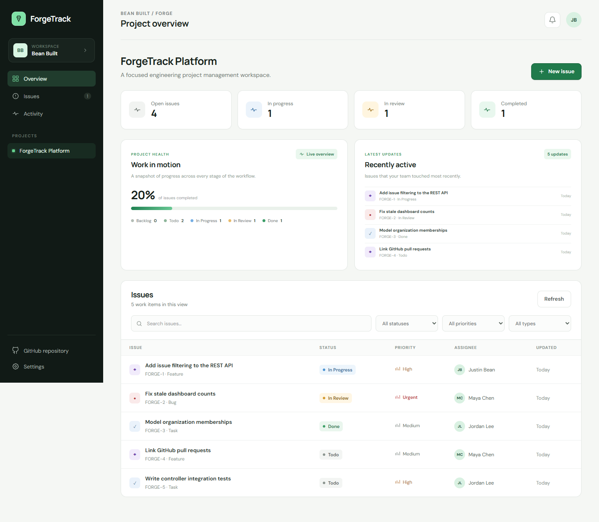
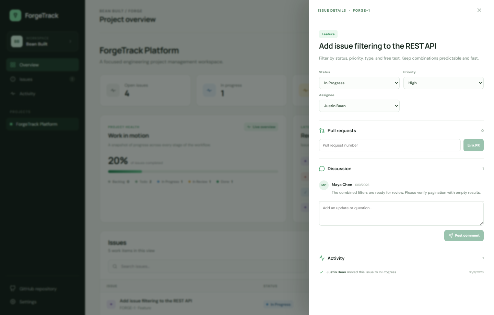
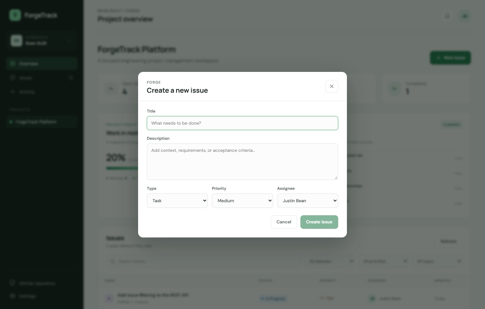
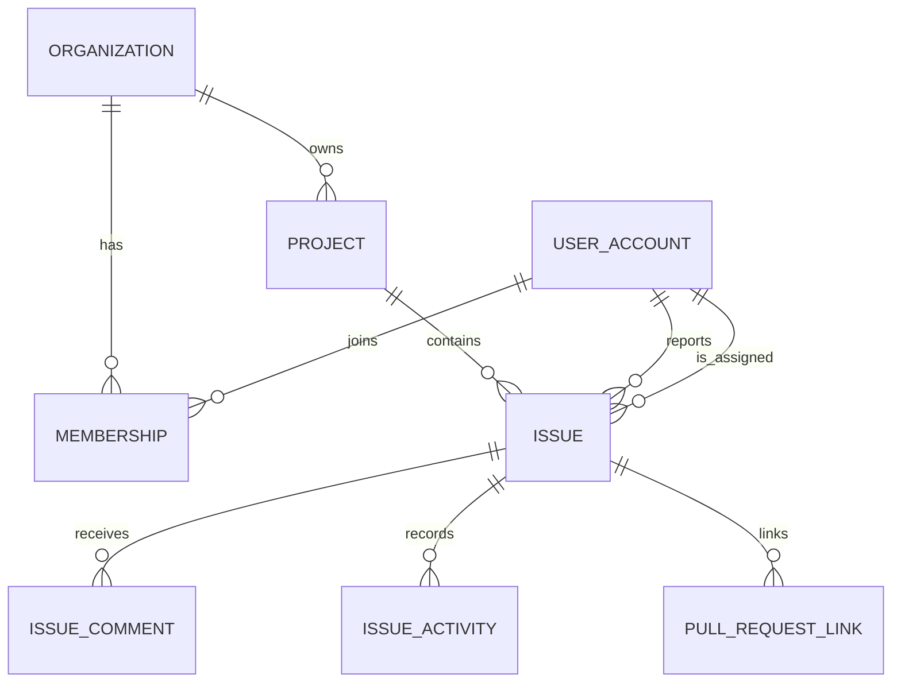

# ForgeTrack

[](https://github.com/JustinBcodes/ForgeTrack/actions/workflows/ci.yml)
  



ForgeTrack is a focused engineering project management platform: a compact Linear/Jira-style issue tracker with GitHub pull-request integration. It is built to demonstrate traditional enterprise backend engineering—relational modeling, transactional business rules, REST API design, validation, database migrations, and automated testing—without unnecessary infrastructure.

| Project surface | What you can inspect |
| --- | --- |
| **Dashboard** | Live workflow totals, completion progress, recent activity, and issue filters |
| **Issue workflow** | Create issues; open details; update status, priority, and assignee; discuss work |
| **GitHub integration** | Validate and link pull requests to issues |
| **Backend design** | 11 REST mappings, transactional issue identifiers, versioned Flyway schema |
| **Quality gates** | Spring integration tests, React interaction tests, and CI on pushes and PRs |

## Product walkthrough

These screenshots use a browser fixture based on the repository's seeded demo project, so they are reproducible without a database. The application uses live API data when run normally.

| Project overview | Issue detail | Create issue |
| --- | --- | --- |
|  |  |  |

The issue detail drawer supports status, priority, and assignee updates, comments, pull-request links, and an activity trail. The dashboard's progress and recent activity come from the existing project aggregation endpoint.

## Stack

- Java 17 and Spring Boot 4.1
- Spring MVC, Spring Data JPA, Hibernate Validator, and Flyway
- React 19, TypeScript, and Vite
- PostgreSQL 17 (H2 for isolated integration tests)
- JUnit 5, MockMvc, Vitest, and Testing Library
- GitHub REST API and GitHub Actions

## What it does

- Creates organizations, projects, and organization memberships
- Creates, assigns, prioritizes, updates, searches, and filters issues
- Supports bug, task, and feature work-item types
- Tracks status changes, comments, and issue activity
- Links GitHub pull requests after validating them through the GitHub REST API
- Calculates project dashboard totals by workflow status
- Seeds a realistic demo workspace for immediate local use

## Architecture

```text
React / TypeScript
       |
       | REST / JSON
       v
Java / Spring Boot
       |
       +---- GitHub REST API
       |
       v
PostgreSQL
```

The backend is one Spring Boot application with controller, service, repository, and domain layers. PostgreSQL is the system of record. Issue numbers are reserved per project inside a pessimistically locked transaction, which prevents duplicate identifiers such as `FORGE-42` during concurrent writes.

## Relational model



Database structure is managed by the versioned Flyway migration in `backend/src/main/resources/db/migration` rather than generated at runtime.

## Run locally

Prerequisites: Java 17+, Maven 3.6.3+, Node.js 22+, npm, and Docker.

1. Start PostgreSQL:

   ```bash
   docker compose up -d postgres
   ```

2. Start the API:

   ```bash
   cd backend
   mvn spring-boot:run
   ```

3. Start the web client in a second terminal:

   ```bash
   cd frontend
   npm install
   npm run dev
   ```

4. Open `http://localhost:5173`.

The default database credentials are intentionally local-only and can be overridden with the variables in `.env.example`. Set `GITHUB_TOKEN` to raise GitHub API rate limits or to link pull requests from private repositories.

## API highlights

| Method | Endpoint | Purpose |
| --- | --- | --- |
| `GET` | `/api/bootstrap` | Load the current workspace, projects, and members |
| `POST` | `/api/organizations` | Create an organization and owner membership |
| `POST` | `/api/projects` | Create a project |
| `POST` | `/api/organizations/{id}/members` | Invite a project member |
| `GET` | `/api/projects/{id}/issues` | Search and filter project issues |
| `GET` | `/api/projects/{id}/dashboard` | Return workflow aggregates and recent activity |
| `POST` | `/api/issues` | Create an issue with a per-project identifier |
| `GET` | `/api/issues/{id}` | Load issue details, comments, activity, and PR links |
| `PATCH` | `/api/issues/{id}` | Update status, priority, assignment, or content |
| `POST` | `/api/issues/{id}/comments` | Add a comment |
| `POST` | `/api/issues/{id}/pull-requests` | Validate and link a GitHub pull request |

Issue filters can be combined: `status`, `priority`, `type`, and free-text `q`. Responses use explicit DTOs so persistence entities never leak across the API boundary.

## Test and build

```bash
cd backend && mvn verify
cd frontend && npm test && npm run build
```

Backend integration tests start the full Spring application against an isolated H2 database in PostgreSQL compatibility mode and exercise issue creation, validation, filtering, and dashboard aggregation through MockMvc. Frontend tests mock the REST boundary and verify the primary dashboard and issue-creation flow.

GitHub Actions runs the backend and frontend checks independently on every push and pull request.

To reproduce the screenshots, start the frontend with `npm run dev` in `frontend`, then run `node scripts/capture.mjs` from that directory. The script intercepts only its own browser's API requests and writes PNGs to `screenshots/`.

## Scope decisions

ForgeTrack deliberately uses one deployable backend and one relational database. It does not include Kafka, Redis, Kubernetes, service discovery, or artificial microservices. Authentication is the next logical production feature; the current MVP keeps identity explicit in requests so the domain workflow and API remain easy to evaluate locally.

## License

MIT
